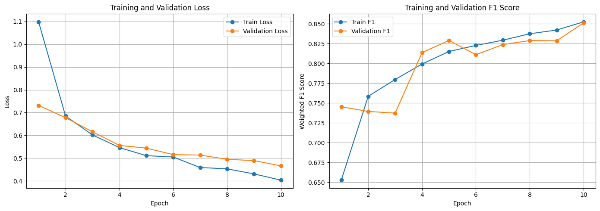
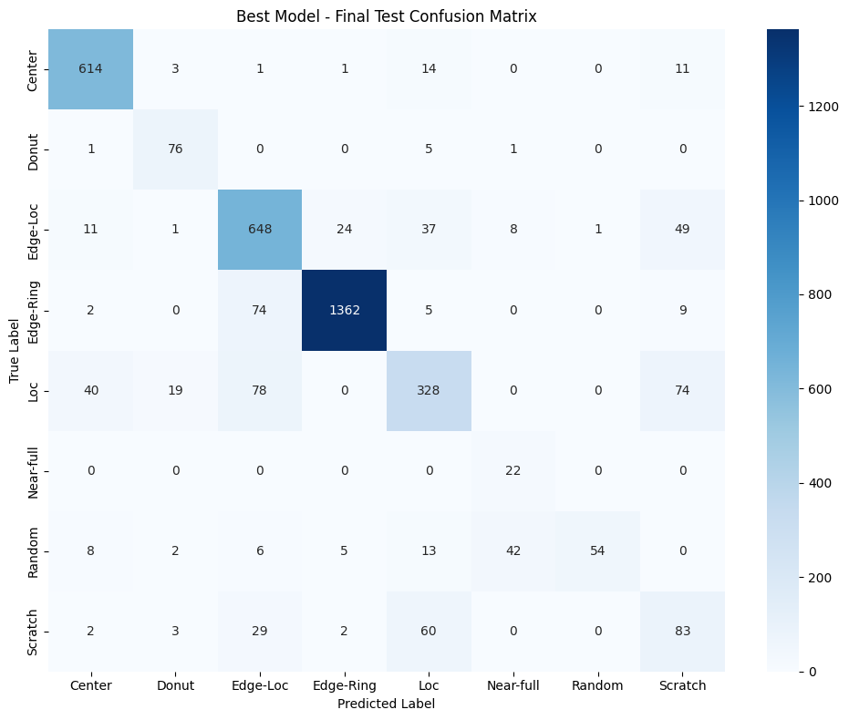
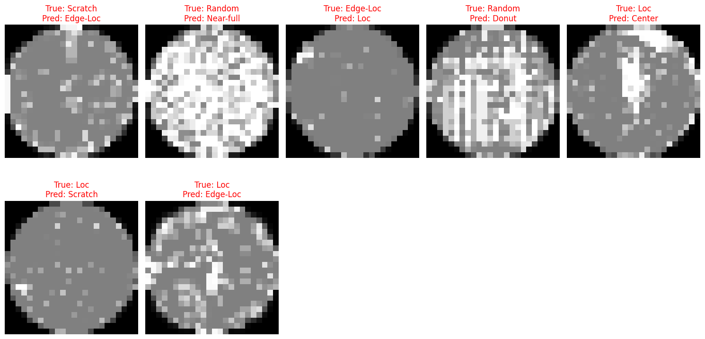

# Wafer Defect Classification Using CNN

A deep learning project for classifying semiconductor wafer defect patterns using a Convolutional Neural Network (CNN) with PyTorch.

This project develops an end-to-end wafer defect classification pipeline, covering dataset preprocessing, class-imbalance handling, CNN training, validation-based model selection, held-out test evaluation, and error analysis.

## Overview

Semiconductor wafer inspection is an important step in identifying manufacturing defects and maintaining process quality.

This project explores an image-based deep learning approach to automatically classify wafer maps into different defect categories.

The primary goal is to build a reproducible baseline classification system while addressing practical challenges such as:

- Severe class imbalance
- Visually similar defect patterns
- Uneven per-class performance
- Reliable evaluation using a held-out test set

The trained model is also exported to ONNX and used as the foundation for a separate C++ inference project.

## Dataset

This project uses the **WM-811K Wafer Map Dataset**, which contains wafer maps representing semiconductor manufacturing patterns.

The original dataset contains both labeled and unlabeled wafer maps. For this classification task, only samples with one of the eight labeled defect types were retained.

### Dataset Distribution

The original dataset contains a large number of unlabeled samples and a highly imbalanced distribution among defect classes.

| Category | Samples |
|---|---:|
| Unlabeled | 638,507 |
| none | 147,431 |
| Edge-Ring | 9,680 |
| Edge-Loc | 5,189 |
| Center | 4,294 |
| Loc | 3,593 |
| Scratch | 1,193 |
| Random | 866 |
| Donut | 555 |
| Near-full | 149 |

After removing `Unlabeled` and `none`, **25,519 labeled fault samples** remained.

### Defect Classes

The classification task contains eight defect classes:

- Center
- Donut
- Edge-Loc
- Edge-Ring
- Loc
- Near-full
- Random
- Scratch

## Data Split

The labeled fault samples were split into training, validation, and test sets using stratified sampling.

| Split | Samples | Ratio |
|---|---:|---:|
| Train | 17,863 | 70% |
| Validation | 3,828 | 15% |
| Test | 3,828 | 15% |
| **Total** | **25,519** | **100%** |

The test set is completely held out from training and model selection.

The model is selected based on validation performance, and the selected checkpoint is evaluated on the test set only after training and model selection are complete.

## Methodology

The project follows the following pipeline:

1. Download the WM-811K dataset through the Kaggle API
2. Load and preprocess wafer map data
3. Extract clean defect labels
4. Remove unlabeled and non-fault samples
5. Encode defect categories into numerical labels
6. Perform a stratified 70/15/15 train-validation-test split
7. Calculate class weights using training data only
8. Normalize wafer maps to the 0–1 range
9. Resize wafer maps to 24 × 24
10. Train a CNN using weighted Cross-Entropy Loss
11. Monitor validation performance during training
12. Save the checkpoint with the best validation weighted F1 score
13. Evaluate the selected model on the held-out test set
14. Analyze class-level errors using classification reports and confusion matrices
15. Export the trained model to ONNX for downstream C++ inference

## Preprocessing

Each wafer map undergoes the following preprocessing steps:

```text
Raw Wafer Map
      ↓
Convert to float32
      ↓
Normalize to 0–1
      ↓
Resize to 24 × 24
      ↓
Add Channel Dimension
      ↓
Tensor: 1 × 24 × 24
```

The resulting input tensor has the shape:

```text
1 × 24 × 24
```

The preprocessing is designed to match the preprocessing used by the downstream C++ inference pipeline.

## Class Imbalance

The dataset contains substantial class imbalance.

For example:

- Edge-Ring: 9,680 samples
- Center: 4,294 samples
- Scratch: 1,193 samples
- Random: 866 samples
- Donut: 555 samples
- Near-full: 149 samples

To reduce the effect of this imbalance, **class-weighted Cross-Entropy Loss** was used.

The class weights were calculated using the training set only:

| Class | Weight |
|---|---:|
| Center | 0.7428 |
| Donut | 5.7400 |
| Edge-Loc | 0.6148 |
| Edge-Ring | 0.3295 |
| Loc | 0.8878 |
| Near-full | 21.4700 |
| Random | 3.6846 |
| Scratch | 2.6741 |

The particularly high weight assigned to `Near-full` reflects its very small number of training samples.

## Model

A lightweight Convolutional Neural Network was implemented using PyTorch.

### Architecture

```text
Input: 1 × 24 × 24
        ↓
Conv2D (1 → 16, 3 × 3)
        ↓
ReLU
        ↓
MaxPool 2 × 2
        ↓
Conv2D (16 → 32, 3 × 3)
        ↓
ReLU
        ↓
MaxPool 2 × 2
        ↓
Flatten
        ↓
Linear
        ↓
8 defect classes
```

### Training Configuration

| Setting | Value |
|---|---|
| Framework | PyTorch |
| Optimizer | Adam |
| Learning Rate | 0.001 |
| Loss | Weighted Cross-Entropy |
| Batch Size | 32 |
| Epochs | 10 |
| Input Size | 1 × 24 × 24 |
| Random Seed | 42 |
| Device | CPU |

The training pipeline uses GPU acceleration automatically when available.

## Model Selection

The best model is selected using **validation weighted F1 score**.

During training, the model is evaluated on the validation set after every epoch.

The checkpoint with the highest validation weighted F1 score is saved and used for final test evaluation.

### Best Validation Performance

The best validation weighted F1 score was:

**0.8326**

This occurred at epoch 8.

The corresponding checkpoint was then evaluated on the held-out test set.

# Test Results

The final evaluation was performed on the **3,828-sample held-out test set**.

### Overall Performance

| Metric | Score |
|---|---:|
| Test Accuracy | **83.25%** |
| Weighted F1 | **83.42%** |
| Macro F1 | **70.17%** |
| Correct Predictions | **3,187 / 3,828** |
| Incorrect Predictions | **641 / 3,828** |
| Error Rate | **16.75%** |

The difference between weighted F1 and macro F1 reflects the strong class imbalance and uneven performance across defect categories.

## Per-Class Test Performance

| Defect Class | Precision | Recall | F1 |
|---|---:|---:|---:|
| Center | 0.9056 | 0.9534 | **0.9289** |
| Donut | 0.7308 | 0.9157 | **0.8128** |
| Edge-Loc | 0.7751 | 0.8318 | **0.8025** |
| Edge-Ring | 0.9770 | 0.9380 | **0.9571** |
| Loc | 0.7100 | 0.6085 | **0.6553** |
| Near-full | 0.3014 | 1.0000 | **0.4632** |
| Random | 0.9818 | 0.4154 | **0.5838** |
| Scratch | 0.3673 | 0.4637 | **0.4099** |

### Key Observations

The model performs particularly well on:

- **Edge-Ring:** F1 = 0.9571
- **Center:** F1 = 0.9289
- **Donut:** F1 = 0.8128
- **Edge-Loc:** F1 = 0.8025

More challenging classes include:

- **Scratch:** F1 = 0.4099
- **Near-full:** F1 = 0.4632
- **Random:** F1 = 0.5838
- **Loc:** F1 = 0.6553

These results indicate that class imbalance and visually similar defect patterns remain significant challenges.

In particular, `Near-full` achieved perfect recall but relatively low precision, while `Random` showed the opposite pattern with very high precision but substantially lower recall. This indicates that the model has difficulty maintaining balanced decision boundaries for some minority classes.

## Results Visualization

### Training History

The training and validation loss/F1 curves show how model performance evolved over the ten training epochs.



### Confusion Matrix

The confusion matrix provides a class-level view of the final model's predictions on the **test set**.



### Misclassified Samples

Examples of incorrectly classified wafer maps from the **test set** can be visualized to investigate common failure patterns.



## Error Analysis

The project includes several forms of error analysis:

- Per-class precision, recall, and F1
- Confusion matrix
- Overall accuracy and error rate
- Visualization of misclassified wafer maps

The test results show that overall performance is relatively strong for several major defect categories, but performance is less consistent for minority classes.

The particularly low F1 score for `Scratch` suggests that its visual characteristics may overlap with other defect patterns. Similarly, the performance of `Random` and `Near-full` demonstrates the difficulty of learning reliable decision boundaries when only a small number of training examples are available.

This motivates further investigation into data augmentation, feature representation, and alternative approaches to class imbalance.

## Reproducibility

A fixed random seed of `42` is used for reproducibility.

```python
SEED = 42
```

The dataset split is stratified and uses the same random seed.

Kaggle API credentials are **not stored in this repository**.

To run the notebook in Google Colab, configure your own Kaggle credentials using **Colab Secrets**:

- `KAGGLE_USERNAME`
- `KAGGLE_KEY`

The dataset is downloaded automatically through the Kaggle API.

## Technologies

- Python
- PyTorch
- NumPy
- pandas
- scikit-learn
- OpenCV
- Matplotlib
- Seaborn
- Google Colab
- Kaggle API
- ONNX

## Requirements

Install the required Python packages with:

```bash
pip install -r requirements.txt
```

## Notebook

The complete implementation is available in the Jupyter/Google Colab notebook:

[`Wafer_Defect_Classification.ipynb`](./notebooks/Wafer_Defect_Classification.ipynb)

The notebook contains the complete workflow, including:

- Dataset download
- Dataset preparation
- Label extraction
- Train/validation/test splitting
- Class-weight calculation
- Image preprocessing
- CNN model construction
- Model training
- Validation-based model selection
- Held-out test evaluation
- Classification reports
- Confusion matrix analysis
- Misclassified sample analysis
- ONNX export
- Inference latency measurement

## Model Export

The selected CNN model was exported to ONNX format for deployment.

```text
PyTorch CNN
     ↓
Best Validation Checkpoint
     ↓
ONNX Export
     ↓
C++ Inference
```

The ONNX model serves as the interface between the Python training pipeline and the downstream C++ inference implementation.

## Future Improvements

Potential improvements include:

- Applying data augmentation to improve generalization
- Investigating stronger approaches for severe class imbalance
- Experimenting with deeper CNN architectures
- Comparing different CNN architectures and hyperparameters
- Improving minority-class representation
- Investigating feature-preserving wafer-map preprocessing
- Exploring transfer learning and more advanced computer vision models
- Performing more detailed confusion-pair analysis
- Evaluating robustness under different preprocessing configurations

## Project Goal

This project was developed to build a practical deep learning pipeline for semiconductor wafer defect classification.

The project focuses on applying CNN-based computer vision techniques to automated wafer inspection while addressing real-world challenges such as class imbalance, limited minority-class samples, and visually similar defect patterns.

Rather than treating accuracy as the only objective, the project evaluates both overall and class-level performance using weighted and macro F1 scores.

This project also serves as the foundation for a separate C++ inference and deployment project.

## Deployment Project

The trained CNN model was exported to ONNX and integrated into a separate C++ inference pipeline.

**C++ deployment repository:**

https://github.com/lucy980509/wafer-cpp-inference

## Repository Structure

```text
wafer-defect-classification/
│
├── README.md
├── requirements.txt
├── .gitignore
│
├── notebooks/
│   └── Wafer_Defect_Classification.ipynb
│
├── images/
│   ├── training_history.png
│   ├── test_confusion_matrix.png
│   └── misclassified_samples.png
│
└── models/
    └── best_wafer_fault_cnn.pth
```
