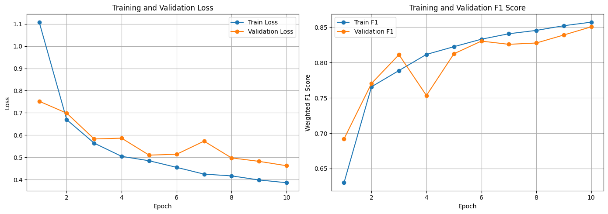
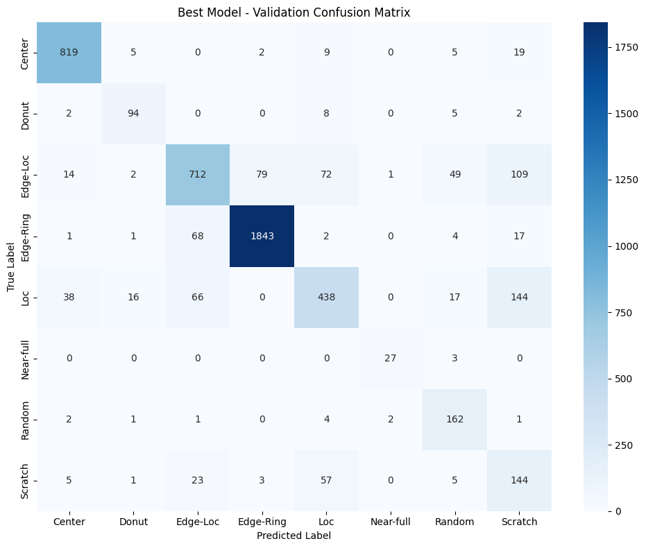
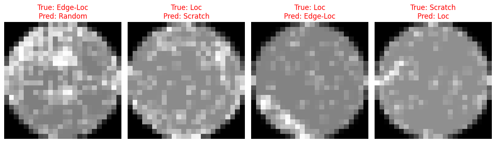

# Wafer Defect Classification Using CNN

A deep learning project for classifying semiconductor wafer defect patterns using Convolutional Neural Networks (CNNs) and PyTorch.

## Overview

Semiconductor wafer inspection is an important step in identifying manufacturing defects and maintaining process quality. This project explores an image-based deep learning approach to automatically classify wafer maps into different defect categories.

The goal of this project is to build an end-to-end classification pipeline, from dataset preprocessing and class-imbalance handling to CNN training, model evaluation, and error analysis.

## Dataset

This project uses the **WM-811K Wafer Map Dataset**, which contains wafer maps representing different semiconductor defect patterns.

Only labeled defect samples were used for this classification task.

The following defect classes were included:

* Center
* Donut
* Edge-Loc
* Edge-Ring
* Loc
* Near-full
* Random
* Scratch

## Methodology

The project follows the following pipeline:

1. Load and preprocess wafer map data
2. Filter labeled defect samples
3. Encode categorical defect labels into numerical classes
4. Split the dataset into training and validation sets
5. Address class imbalance using class-weighted loss
6. Normalize and resize wafer maps to 24 × 24 input images
7. Train a CNN using PyTorch
8. Select the best model based on validation F1 score
9. Evaluate model performance using classification metrics
10. Analyze misclassified wafer maps

### Model

A Convolutional Neural Network (CNN) was implemented using PyTorch.

The training pipeline uses:

* PyTorch
* Adam optimizer
* Weighted Cross-Entropy Loss
* ReLU activation
* Max Pooling
* Batch-based training
* GPU acceleration when available

### Architecture

The CNN takes a single-channel 24 × 24 wafer map as input.

```text
Input: 1 × 24 × 24
        ↓
Conv2D (1 → 16)
        ↓
ReLU
        ↓
MaxPool 2 × 2
        ↓
Conv2D (16 → 32)
        ↓
ReLU
        ↓
MaxPool 2 × 2
        ↓
Flatten
        ↓
Linear
        ↓
8 defect classes
```

## Evaluation

Because the dataset contains imbalanced defect classes, **weighted F1 score** was used alongside accuracy to evaluate model performance.

### Validation Results

The best model was selected based on validation weighted F1 score.

| Metric | Score |
|---|---:|
| Accuracy | 84.74% |
| Weighted F1 | 85.12% |
| Macro F1 | 79.49% |

The final CNN model achieved a validation weighted F1 score of **0.8512**.

## Results Visualization

### Training History

The training and validation curves show how model performance changed across epochs.



### Confusion Matrix

The confusion matrix provides a class-level view of the model's predictions and highlights which defect categories are most frequently confused with one another.



### Misclassified Samples

The following examples show wafer maps that were incorrectly classified by the best-performing model during validation.



## Error Analysis

The project includes:

* Confusion matrix analysis
* Classification reports
* Visualization of misclassified wafer maps
* Overall validation error analysis

The error analysis showed that performance varied across defect categories.

Classes such as **Scratch** and **Loc** remained challenging for the model, achieving lower F1 scores:

- Scratch: 0.4743
- Loc: 0.6565

These results suggest that visually similar defect patterns and class imbalance remain important challenges for wafer defect classification.

## Technologies

- Python
- PyTorch
- NumPy
- pandas
- scikit-learn
- OpenCV
- Matplotlib
- Seaborn
- Google Colab
- Kaggle API

## Requirements

Install the required Python packages with:

```bash
pip install -r requirements.txt
```

## Notebook

The complete implementation is available in the Jupyter/Google Colab notebook:

[`wafer_fault_classification.ipynb`](./notebooks/wafer_fault_classification.ipynb)
The notebook contains the complete workflow, including:

* Dataset preparation
* Data preprocessing
* CNN model construction
* Model training
* Validation
* Classification evaluation
* Confusion matrix analysis
* Misclassified sample analysis

## Reproducibility

Kaggle API credentials are **not stored in this repository**.

To run the notebook in Google Colab, configure your own Kaggle credentials using **Colab Secrets**:

* `KAGGLE_USERNAME`
* `KAGGLE_KEY`

The dataset is downloaded automatically through the Kaggle API.

### Dataset Download

The notebook automatically downloads the WM-811K dataset using the Kaggle API and prepares the dataset for training.

Users should provide their own Kaggle API credentials rather than using credentials stored in the repository.

## Future Improvements

Potential improvements include:

* Applying data augmentation to improve generalization
* Experimenting with deeper CNN architectures
* Comparing different CNN architectures and hyperparameters
* Investigating alternative approaches for severe class imbalance
* Exploring transfer learning and more advanced computer vision models
* Evaluating the model on a separate test dataset
* Investigating more robust approaches for visually similar defect categories

## Project Goal

This project was developed to build a practical deep learning pipeline for semiconductor wafer defect classification.

The project focuses on applying CNN-based computer vision techniques to automated wafer inspection while addressing real-world challenges such as class imbalance and visually similar defect patterns.

This project serves as the foundation for a separate model deployment project focused on C++ inference.

## Deployment Project

The trained CNN model was exported to ONNX format and deployed using a C++ inference engine.

C++ deployment repository:

https://github.com/lucy980509/wafer-cpp-inference

wafer-defect-classification/
│
├── README.md
├── requirements.txt
├── .gitignore
│
├── notebooks/
│   └── Wafer_Defect_Classification.ipynb
│
├── images/
│   ├── training_history.png
│   ├── confusion_matrix.png
│   └── misclassified_samples.png
│
└── models/
    └── best_wafer_fault_cnn.pth
